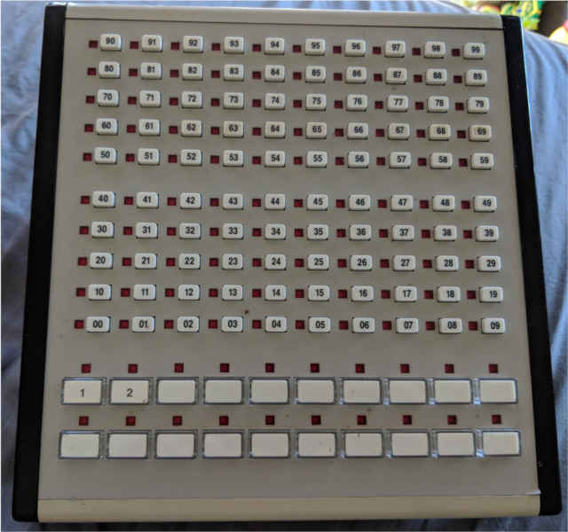

## AT&T 26A Direct Extension Selector Console Driver

The AT&T 26A Direct Extension Selector Console is part of the AT&T 302 [Attendant Console](https://en.wikipedia.org/wiki/Attendant_console) from the early 1990s. Attendant Consoles like these could attach to large corporate phone systems ([PBX](https://en.wikipedia.org/wiki/Private_branch_exchange)), and cost quite a lot to install. Even now, the 302 sells for almost $1000.

Luckily, the 26A can be picked up for a much cheaper $20 (at least at the time of writing). This price point, and a simple protocol, makes the 26A a good option for various hobby projects needing a grid of buttons and lights.

This project exists to [document the 26A hardware/protocol](./docs/README.md), and provide a library for controlling
