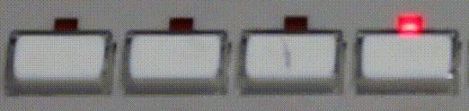
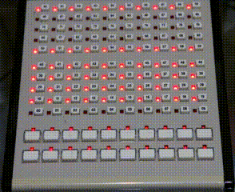

## AT&T 26A Direct Extension Selector Console Driver

The AT&T 26A Direct Extension Selector Console is part of the AT&T 302 [Attendant Console](https://en.wikipedia.org/wiki/Attendant_console) from the early 1990s. Attendant Consoles like these could attach to large corporate phone systems ([PBX](https://en.wikipedia.org/wiki/Private_branch_exchange)), and cost quite a lot to install. Even now, the 302 sells for almost $1000.

Luckily, the 26A can be picked up for a much cheaper $20 (at least at the time of writing). This price point, and a simple protocol, makes the 26A a good option for various hobby projects needing a grid of buttons and lights.

This project exists to [document the 26A hardware/protocol](./docs/README.md), and provide a library for controlling

## Capabilities & Limitations

The AT&T 26A is quite old, and its industry requirements left it with some interesting features and limitations.

### LEDs

Each LED represented the state of a phone line that could be free, on-hold, ringing, or in-use.

There is no reliable way to read the state of lights from the 26A (it is possible to read the state of the bottom 20 lights, but not the main 100).

#### Refresh Rate

The 26A can only illuminate a row of LEDs at a time. It pulses LEDs quickly and takes advantage of persistence of vision to give the impression of constant illumination. This was done to save IO lines, and is still done all the time today.

Unfortunately, the refresh rate on a device from 1990 is not terribly impressive, and results in a 'tearing' effect when photographed/recorded on cameras with standard settings. Here is a video of every LED on the 26A in the solid 'ON' state.

This effect is caused by the camera's framerate/exposure-time configuration. It is not nearly as noticeable with the human eye, but you can detect a flicker if you stare at it close. Moving the 26A quickly makes the flicker more obvious. To film the 26A, turn down the framerate and increase exposure time.

### Buttons

Attendant Consoles are usually used to do one thing at a time with a very simple UI. There was no need to detect long presses, or multiple simultaneous button presses.

This is unfortunately the biggest limitation for using the AT&T 26A as a general input device since it only reports when a button is pressed, and will only report another press after all depressed buttons have been released.

### Protocol & Control

#### Reset (the many uses of)

AT&T needed to make sure the 26A could run for a long time with few service calls. To this end, the 26A regularly sends keep-alive messages, and has a hardware reset line directly in the RJ-45 connector. If the 26A ever stopped responding for any reason, the 302 could do a full hardware reset without the user even noticing.

This easy reset mechanism makes up for the protocol being unable to read the state of every LED: if the 26A and the 302 ever get out of sync, just reset it! A reset is also a reasonably fast way of clearing the entire display.

#### Obfuscation

There are several weird decisions in the control protocol that only make controlling or emulating the AT&T 26A more difficult. This includes:

* the baud rate (non standard 10752).
* encoding most integers in a 7 bit left shifted format.
* arbitrary values for LED states (0x0, 0x8, 0xD, and 0xF).
* The inability to set the state of 71 LEDs at a time (but 70 and 72 is fine).

The only purpose for all this is obfuscation to prevent competitors from using or making compatible replacements to the 26A.

All of this is documented in [The AT&T 26A Protocol](./docs/PROTOCOL.md).
