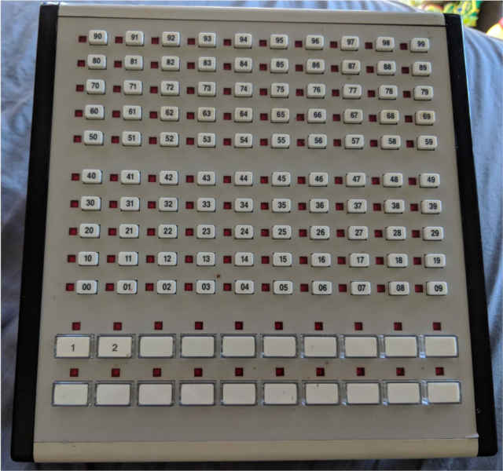

# AT&T 26A Full View

# AT&T 26A Disassembly

1) Remove the right plastic panel by prying the clip up off of the face.

2) Slide the top and bottom panel off.

3) Remove the 4th panel much like the first, exceot it has to be pried up from the bottom.

4) Pull the 26A front panel assembly out of the case.

5) Flip the front panel assembly over. You will see the RJ45 adapter board attached to the main board.

6) Take apart the front panel assembly by pushing in the clips on the sides.
    The RJ45 adapter board can be removed by pushing the clips holding it down.

7) The main board is no longer held into the front assembly and can be removed by simply flipping the assembly over.

