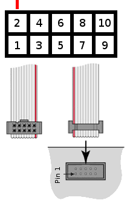
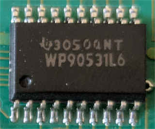

# AT&T 26A Main Board

## Pinout (10-pin)

| Pin | Purpose | Voltage |
| --- | ------- | ------- |
|  1  | GND     | GND     |
|  2  | VCC     | 5 VDC   |
|  3  | VCC     | 5 VDC   |
|  4  | GND     | GND     |
|  5  | TX      | 5 VDC   |
|  6  | GND     | GND     |
|  7  | RX      | 5 VDC   |
|  8  | GND     | GND     |
|  9  | Reset   | 5 VDC   |
|  10 | GND     | GND     |

## Components

1) Microcontroller
	* 
	* Model: SC87C51CCA44
	* Type: Intel 8051
	* Footprint: CPLC44
2) Connector Port IO Buffer (Octal buffer/line driver)
	* 
	* Model: WP90531L6 (74HC244 compatible)
	* Only 3 out of 8 drivers are used.
3) 8-bit Registers
	* 
	* Model: WP90532L6 (SN74S32 compatible)
4) Hex Inverter (Open Drain)
	* Model: MM74HCT05M
5) Crystal Resonator
6) Power & Data Connector
7) Column Driver Transistors
8) Row Driver Transistors

## Power Usage

With all leds at full power, the 26A draws about 0.30 A of
current. For my 5.11V usb port, that ended up being 1.53W.
