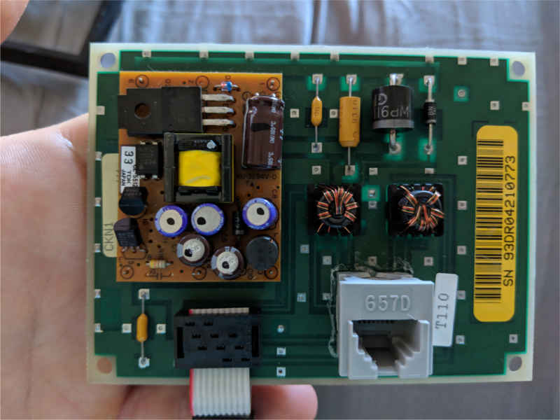
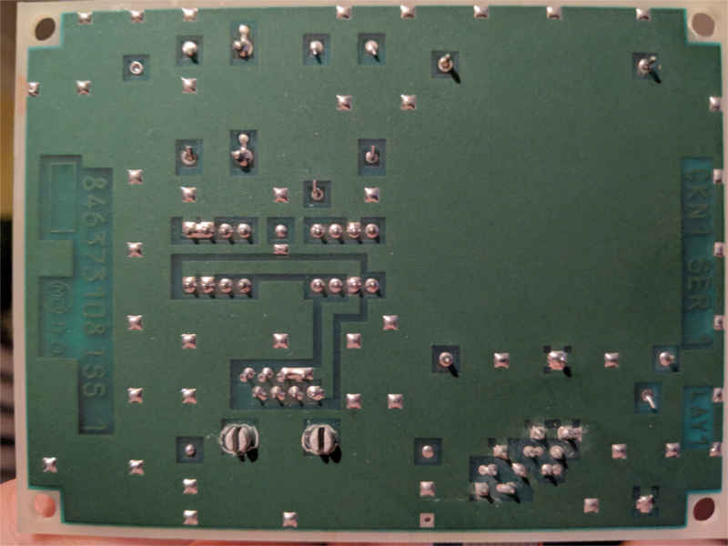
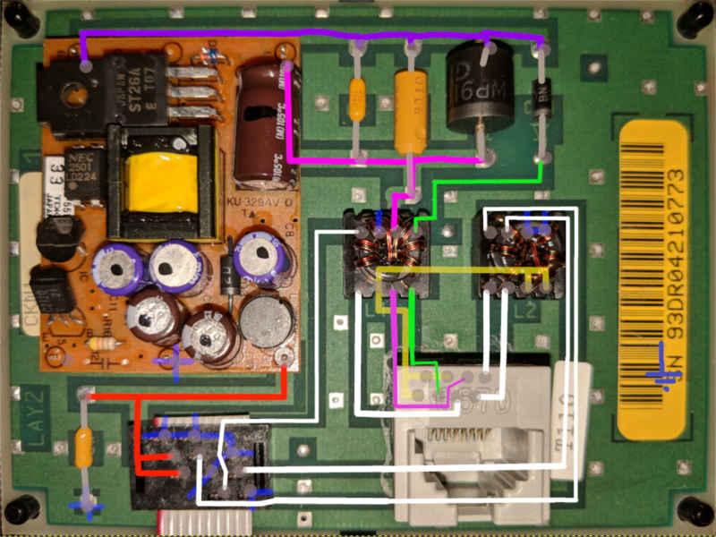
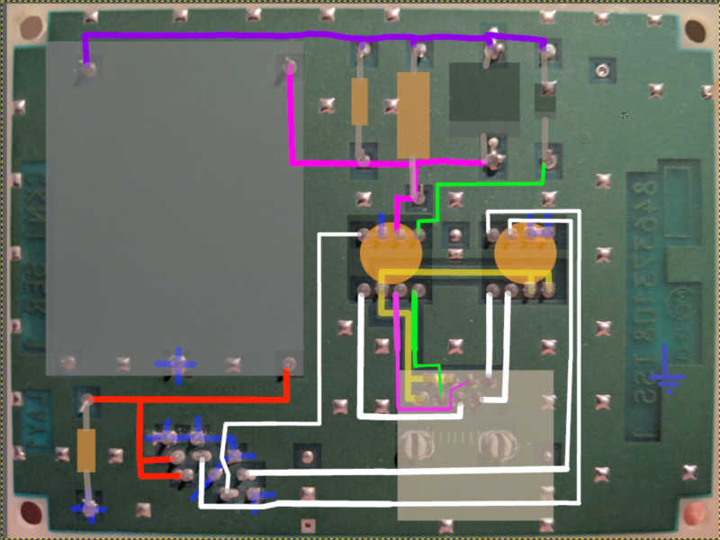
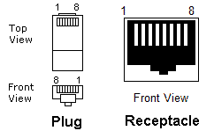
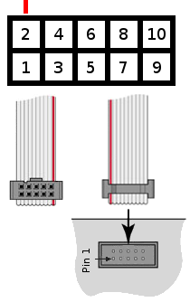

# AT&T 26A RJ-45 Adapter Board

The RJ-45 Adapter board:
* converts a RJ-45 connector to a 10 pin 2 row pin header.
* cleans up signal noise from the RJ-45 side.
* Converts VCC voltage.

| Parameter           | Value  |
| ---------           | ------ |
| VCC RJ45            | 48V DC |
| VCC 26A             | 5V DC  |
| Data Signal Voltage | 5V DC  |

The daughter board is the 48VDC->5VDC converter.

The inductor coils appear to remove noise from the groups of pins.

## RJ-45 PINOUT

| Pin | Purpose               | Voltage |
| --- | --------------------- | ------- |
|  1  | 26A GND               | GND     |
|  2  | 26A GND               | GND     |
|  3  | RJ-45 GND             | GND     |
|  4  | 26A GND               | GND     |
|  5  | 26A RX                | 5 VDC   |
|  6  | RJ-45 VCC             | 48 VDC  |
|  7  | Reset 26A             | 5 VDC   |
|  8  | 26A TX                | 5 VDC   |

__Note:__ The 26A GND, 26A Reset, 26A TX, and 26A RX pins on the RJ-45 board connect to the GND, Reset, TX, and RX pins respectively on the 10-pin header, but go through a coil to clean up the signal. Because of this, these are not the same nets, and thus maintain their different names.

## 10-pin mainboard cable PINOUT

| Pin | Purpose    | Voltage |
| --- | ---------- | ------- |
|  1  | GND        | GND     |
|  2  | VCC        | 5 VDC   |
|  3  | VCC        | 5 VDC   |
|  4  | GND        | GND     |
|  5  | TX         | 5 VDC   |
|  6  | GND        | GND     |
|  7  | RX         | 5 VDC   |
|  8  | GND        | GND     |
|  9  | Reset      | 5 VDC   |
|  10 | GND        | GND     |
